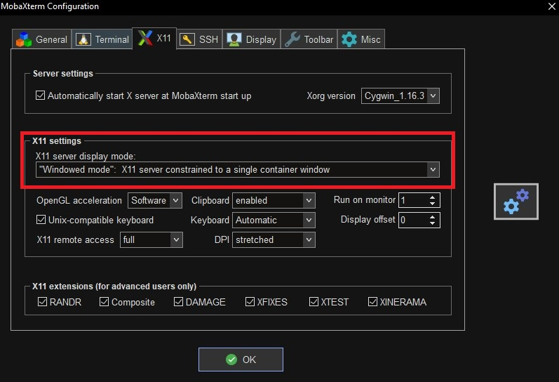

# ubuntu desktop install on wsl2

### upgrade and update ubuntu 

```bash
sudo apt update -y && sudo apt upgrade -y 
```


get mkobaxterm
set it up for starting a xserver



### get teh wsl ip add to .bashrc or .zshrc

```bash
export DISPLAY="$(/sbin/ip route | awk '/default/ { print $3 }'):0" 
sudo apt install xfce4 xfce4-goodies
```

### install chrome and vscode

```bash
install chrome
wget https://dl.google.com/linux/direct/google-chrome-stable_current_amd64.deb
sudo dpkg -i google-chrome-stable_current_amd64.deb

install code:
sudo apt install wget gpg apt-transport-https -y
wget -qO- https://packages.microsoft.com/keys/microsoft.asc | gpg --dearmor > packages.microsoft.gpg
sudo install -D -o root -g root -m 644 packages.microsoft.gpg /etc/apt/keyrings/packages.microsoft.gpg
echo "deb [arch=amd64,arm64,armhf signed-by=/etc/apt/keyrings/packages.microsoft.gpg] https://packages.microsoft.com/repos/code stable main" | sudo tee /etc/apt/sources.list.d/vscode.list > /dev/null
rm packages.microsoft.gpg
sudo apt update
sudo apt install code
```

### fix vscode for xcfe

open vscode
ctrl + shift + p
preferences configure runtime arguments
add to argv.json 
"password-store": "gnome-libsecret"
save and restart vscode

# windows symbilic links

```bash
mklink /J C:\usr\code\swapan-projects\openshift\picocli-jline3-example C:\usr\code\swapan-projects\console-apps\picocli-jline3-example 
mklink /J  C:\usr\code\swapan-projects\openshift\os_picocli-jline3-shade-jlink C:\usr\code\swapan-projects\console-apps\os_picocli-jline3-shade-jlink
mklink /J  C:\usr\code\swapan-projects\openshift\os-power-shell-wrapper C:\usr\code\swapan-projects\console-apps\pws\os-power-shell-wrapper
mklink /J  C:\usr\code\swapan-projects\openshift\spring-shell-demo C:\usr\code\swapan-projects\console-apps\spring-shell-demo
mklink /J  C:\usr\code\swapan-projects\openshift\gh-jmeter-on-ocp C:\usr\code\github\jmeter-on-ocp
mklink /J  C:\usr\code\swapan-projects\openshift\gh-powershell C:\usr\code\github\powershell
mklink /J  C:\usr\code\swapan-projects\openshift\docs C:\usr\code\swapan-projects\README
```

```bash
git rm -r --cached console-apps/os_picocli-jline3-shade-jlink/cluster-selector/target/
```

## To run a Makefile directly from VSCode on Windows using Git Bash, follow these steps

You can set up a custom task in VSCode to run your Makefile. Here's how:

1. Press `Ctrl+Shift+P` and select `Tasks: Configure Task`.
2. If prompted, select `Create tasks.json file from template`, then choose `Others`.
3. Add a new task configuration for running `make`:

```json
   {
       "version": "2.0.0",
       "tasks": [
           {
               "label": "Run Makefile",
               "type": "sit rm -r --cached hell",
               "command": "make",
               "args": [],
               "problemMatcher": [],
               "group": {
                   "kind": "build",
                   "isDefault": true
               },
               "options": {
                   "shell": {
                       "executable": "C:\\Program Files\\Git\\bin\\bash.exe"
                   }
               },
               "presentation": {
                   "reveal": "always",
                   "panel": "shared"
               }
           }
       ]
   }
```

### Step 4: Run the Task

1. Open the terminal in VSCode (`Ctrl+\``).
2. Press `Ctrl+Shift+B` to run the "Run Makefile" task, or you can go to `Terminal > Run Build Task` and choose your task.

# run jmeter on docker, openshift laptop

```
podman build -t localhost/jmeter:latest ./container-image
```

podman run --rm -it --name jmeter localhost/jmeter:latest

APP_NAMESPACE="jmeter"
GIT_REPOSITORY="<https://github.com/alvarolop/jmeter-on-ocp.git>"
oc new-project $APP_NAMESPACE --display-name="JMeter Testing" --description="This namespace contains resources to deploy JMeter"

oc process -f templates/jmeter-bc.yaml -p APP_NAMESPACE=$APP_NAMESPACE -p GIT_REPOSITORY=$GIT_REPOSITORY | oc apply -f -\

create a ConfigMap that will store your application configuration:

JMETER_TEST="example"
oc create configmap jmeter-config -n $APP_NAMESPACE \
--from-file=${JMETER_TEST}.jmx=tests/${JMETER_TEST}/jmeter-test-plan.jmx \
--from-file=config.properties=tests/${JMETER_TEST}/config-k8s.properties

oc process -f templates/jmeter-dc.yaml \
    -p APP_NAMESPACE=$APP_NAMESPACE \
    -p TEST_NAME=$JMETER_TEST | oc apply -f -

# Get JMeter pod name

```JMETER_POD=$(oc get pods -l app=jmeter -n $APP_NAMESPACE --template='{{(index .items 0).metadata.name}}')
NOW=$(date +"%Y-%m-%d_%H-%M-%S")
mkdir ./results/$NOW-$TEST
oc rsync $JMETER_POD:/opt/jmeter/results/$TEST-report/ ./results/$NOW-$TEST
```

1. Useful links
Official Apache JMeter documentation.

Medium: Start Learning JMeter With Sample Test Cases.

8. Annex: Running jmeter in your laptop
   
`JMETER_BASE=$(pwd)
TEST_PLAN=test-03
NOW=$(date +"%Y-%m-%d_%H-%M-%S"); jmeter -n -p "$JMETER_BASE/tests/${TEST_PLAN}/config.properties" -t "$JMETER_BASE/tests/${TEST_PLAN}/jmeter-test-plan.jmx" -l "$JMETER_BASE/results/${NOW}-${TEST_PLAN}.jtl" -e -o "$JMETER_BASE/results/${NOW}-${TEST_PLAN}-report"; cp -r $JMETER_BASE/tests/${TEST_PLAN}/ $JMETER_BASE/results/${NOW}-${TEST_PLAN}-report
`

```
jdeps --ignore-missing-deps --module-path target/libs --multi-release 17 --recursive --print-module-deps target/cluster-selector-1.0.0.jar

Error: 
Modules openshift.model and openshift.model.config 
export package io.fabric8.openshift.api.model.config.v1 to module kubernetes.model.apps
```


### remove dir from git trackign

```bash
git rm -r --cached console-apps/picocli-jline3-example/target

```